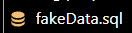

# How import Database?

## With PhpMyAdmin :

* Check that you are in MySQL language (top left)
* Click on “New database”.
* Create your database (database name: cogip), and select the character set “utf8mb4_general_ci”.  

* Once the database has been created, select it and click on “Import”.
* Select cogip.sql  

* Make sure the character set is set to utf-8
* Import!

### Import test data :

* Copy the contents of fakeData.sql  

* Click on the previously created database
* Select the “SQL” tab
* Paste contents of fakeData.sql
* Press ctrl+enter or “execute” at bottom right.
=======
# Comment Importer ?

## Sur PhpMyAdmin :

* Vérifiez que vous êtes bien en langage MySQL (en haut à gauche)
* Cliquez sur "nouvelle base de données"
* Créez votre base de données (nom de base : cogip), et sélectionnez le jeu de caractères "utf8mb4_general_ci"
* Une fois la database créé, sélectionnez-la et cliquez sur "Importer".
* Sélectionnez cogip.sql
* Assurez-vous que le jeu de caractères soit paramétré sur utf-8
* Importez !

### Importer les données de test :

* Copiez le contenu de fakeData.sql
* Cliquez sur la base de données précedemment créée
* Sélectionnez l'onglet "SQL"
* Collez le contenu de fakeData.sql
* Appuyez sur ctrl+entrée ou "exécuter" en bas à droite.
